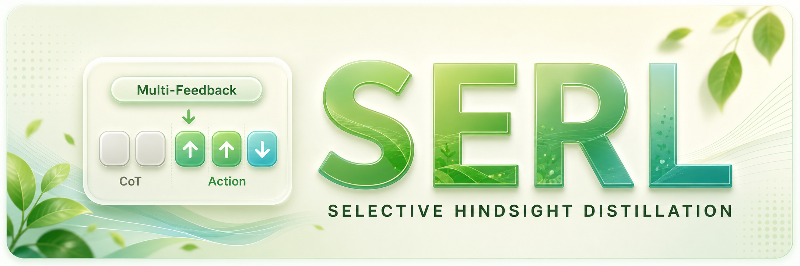
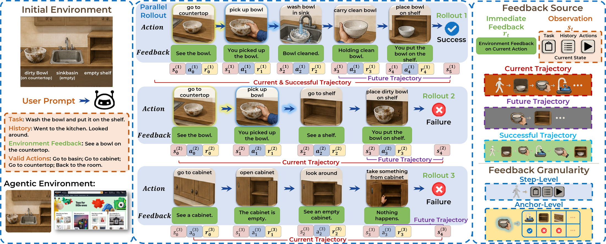
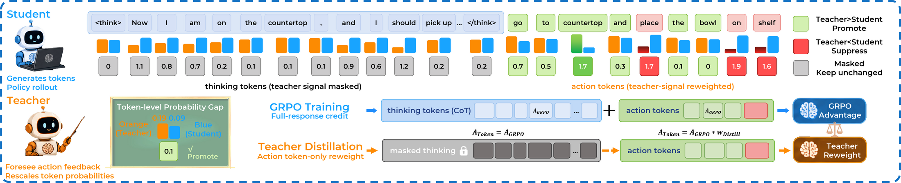

<p align="center">
  
</p>

# SERL: Selective Hindsight Distillation for Long-Horizon LLM Agents

<p align="center">
  <a href="./LICENSE"></a>
  
  
  
</p>

<p align="center">
  <a href="#"></a>
  <a href="#"></a>
  <a href="#"></a>
  <a href="#"></a>
</p>

SERL is a reinforcement-learning recipe for text-based LLM agents. It uses multi-feedback from agent-environment rollouts to build a teacher signal, then applies that signal selectively to action tokens while leaving chain-of-thought and formatting tokens under the original GRPO objective.

This release focuses on two long-horizon agent environments:

- ALFWorld
- WebShop

Main entrypoints:

- `recipe/serl/run_alfworld.sh`
- `recipe/serl/run_webshop.sh`

## 📰 News

- **[2026.05]** SERL is released with training recipes for ALFWorld and WebShop.

## ✨ Highlights

1. **Multi-feedback hindsight signal.** SERL can condition the teacher on immediate feedback, next observation, future trajectory, successful trajectory, current trajectory, or combinations of these signals.
2. **Action-token-only distillation.** The teacher signal reweights action tokens, while thinking tokens keep the normal GRPO full-response credit. This matches the method design in which feedback should guide what the agent does, not overwrite every reasoning token.
3. **Flexible feedback granularity.** SERL supports step-level feedback and anchor-level variants that group semantically related states before applying hindsight feedback.
4. **Practical agent recipes.** The repository keeps a compact open-source surface: one ALFWorld script, one WebShop script, and a single SERL config.

## 🧭 Method Overview

SERL targets the sparse-reward setting common in interactive agent tasks. During rollout, each sampled trajectory contains states, actions, task rewards, and immediate feedback. SERL builds privileged hindsight contexts from these records and asks a synchronized teacher policy to score the student's action tokens under that feedback.

<p align="center">
  
</p>

Figure 1 illustrates the feedback design. SERL can draw feedback from the current step, the next observation, the current trajectory, the future trajectory, and successful trajectories. It can also switch between step-level and anchor-level granularity.

<p align="center">
  
</p>

Figure 2 shows the selective distillation objective. Teacher-student probability gaps are converted into bounded action-token weights. Thinking tokens are masked from teacher reweighting, while action tokens are promoted, suppressed, or kept unchanged according to the teacher signal.

Original figure PDFs are kept for high-resolution use:

- [Figure 1 PDF](./docs/serl/Figure1.pdf)
- [Figure 2 PDF](./docs/serl/Figure2.pdf)

## 🗂️ Repository Layout

```text
recipe/serl/                         SERL training recipe, config, trainer, and launch scripts
recipe/serl/run_alfworld.sh          ALFWorld launch script
recipe/serl/run_webshop.sh           WebShop launch script
agent_system/environments/           Multi-turn agent environment wrappers
judge_utils/                         Utilities for LLM-judged feedback
examples/data_preprocess/prepare.py  Text-mode parquet preparation
docs/serl/                           SERL logo and paper figures
```

## ⚙️ Installation

### 🧱 Base Runtime

Create the base SERL environment from the repository root:

```bash
conda create -n serl python==3.12 -y
conda activate serl

pip3 install vllm==0.11.0
pip3 install flash-attn==2.7.4.post1 --no-build-isolation --no-cache-dir
pip install -e .
```

Environment packages may have conflicting Python and dependency requirements. Use a separate conda environment for each backend when needed.

### 🧪 ALFWorld

Install ALFWorld:

```bash
pip3 install gymnasium==0.29.1
pip3 install stable-baselines3==2.6.0
pip install alfworld
```

Download PDDL files, game files, and the pretrained MaskRCNN detector:

```bash
alfworld-download -f
```

SERL reads ALFWorld games from `ALFWORLD_DATA`. If you install the data outside the default `~/.cache/alfworld`, export the path before launching:

```bash
export ALFWORLD_DATA=/path/to/alfworld
```

Use `--extra` if you also want pretrained checkpoints and seq2seq data:

```bash
alfworld-download -f --extra
```

Verify the text-game installation:

```bash
alfworld-play-tw
```

### 🛒 WebShop

WebShop requires Python `<=3.10`, so create a dedicated environment:

```bash
conda create -n serl-webshop python==3.10 -y
conda activate serl-webshop
```

Install WebShop dependencies and data inside the bundled WebShop directory:

```bash
cd ./agent_system/environments/env_package/webshop/webshop
./setup.sh -d small
```

The default SERL WebShop config uses the 1k WebShop split and expects these files to exist under `agent_system/environments/env_package/webshop/webshop/`:

```text
data/items_shuffle_1000.json
data/items_ins_v2_1000.json
search_engine/indexes/
```

Use `./setup.sh -d all` instead if you plan to run with `env.webshop.use_small=False`. If `gdown` fails, visit `https://drive.google.com/`, get your Google Drive cookie, and paste it into `.cache/gdown/cookies.txt`. Manual download of the required files is also acceptable, as long as the files are placed in the WebShop directory above and the search index has been built.

After WebShop is installed, return to the SERL repository root and install the training dependencies in the same `serl-webshop` environment:

```bash
cd /path/to/SERL
pip3 install torch==2.6.0 --index-url https://download.pytorch.org/whl/cu124
pip3 install flash-attn==2.7.4.post1 --no-build-isolation
pip3 install -e .
pip3 install vllm==0.8.2
```

Warnings about `spacy` or `weasel` requiring an older `typer` can be ignored for the WebShop training scripts.

## 🚀 Quickstart

Prepare the text-mode parquet files. The parquet files provide the text modality marker and dataset size. Task observations, valid actions, rewards, and feedback are produced online by the environment during rollout.

```bash
mkdir -p ~/data/serl/text
python3 examples/data_preprocess/prepare.py \
  --mode text \
  --local_dir ~/data/serl \
  --train_data_size 256 \
  --val_data_size 256
```

This creates:

```text
~/data/serl/text/train.parquet
~/data/serl/text/test.parquet
```

Run ALFWorld:

```bash
conda activate serl
bash recipe/serl/run_alfworld.sh
```

Run WebShop:

```bash
conda activate serl-webshop
bash recipe/serl/run_webshop.sh
```

The launch scripts default to `Qwen/Qwen2.5-7B-Instruct`, `SAMPLING_MODE=immediate_feedback`, and `TRAJECTORY_FORMAT=response`.

Common ALFWorld override:

```bash
MODEL_PATH=Qwen/Qwen2.5-7B-Instruct \
TRAIN_FILE=~/data/serl/text/train.parquet \
VAL_FILE=~/data/serl/text/test.parquet \
OUTPUT_ROOT=./outputs/alfworld \
SAMPLING_MODE=immediate_feedback \
TRAJECTORY_FORMAT=response \
bash recipe/serl/run_alfworld.sh
```

Common WebShop override:

```bash
MODEL_PATH=Qwen/Qwen2.5-7B-Instruct \
TRAIN_FILE=~/data/serl/text/train.parquet \
VAL_FILE=~/data/serl/text/test.parquet \
OUTPUT_ROOT=./outputs/webshop \
SAMPLING_MODE=immediate_feedback \
TRAJECTORY_FORMAT=response \
bash recipe/serl/run_webshop.sh
```

The first positional argument can switch the rollout engine:

```bash
bash recipe/serl/run_alfworld.sh vllm
bash recipe/serl/run_webshop.sh vllm
```

Arbitrary Hydra overrides can be appended after the script:

```bash
SAMPLING_MODE=anchor_successful_sample_immediate_feedback \
bash recipe/serl/run_webshop.sh \
  trainer.total_epochs=150 \
  actor_rollout_ref.actor.optim.lr=1e-6
```

## 💬 Supported Feedback Modes

Set the feedback source with `SAMPLING_MODE=<mode>`. Implementation names use `successful_sample` for a successful trajectory reference.

| `SAMPLING_MODE` | Feedback source |
| --- | --- |
| `immediate_feedback` | immediate per-step feedback |
| `next_observation` | next observation |
| `future_trajectory` | future trajectory |
| `successful_sample_or_immediate_feedback` | successful trajectory or immediate feedback |
| `successful_sample_immediate_feedback` | successful trajectory and immediate feedback |
| `successful_sample_next_observation` | successful trajectory and next observation |
| `successful_sample_future_trajectory` | successful trajectory and future trajectory |
| `successful_sample_future_trajectory_immediate_feedback` | successful trajectory, future trajectory, and immediate feedback |
| `successful_sample_future_trajectory_next_observation` | successful trajectory, future trajectory, and next observation |

Examples:

```bash
SAMPLING_MODE=immediate_feedback bash recipe/serl/run_alfworld.sh
SAMPLING_MODE=successful_sample_immediate_feedback bash recipe/serl/run_webshop.sh
SAMPLING_MODE=successful_sample_future_trajectory_next_observation bash recipe/serl/run_webshop.sh
```

## ⚓ Anchor-Level Feedback

Anchor placement is enabled with the `anchor_` prefix. To disable anchor placement, use the corresponding non-anchor mode.

Supported anchor modes:

```text
anchor_immediate_feedback
anchor_next_observation
anchor_future_trajectory
anchor_successful_sample_or_immediate_feedback
anchor_successful_sample_immediate_feedback
anchor_successful_sample_next_observation
anchor_successful_sample_future_trajectory
anchor_successful_sample_future_trajectory_immediate_feedback
anchor_successful_sample_future_trajectory_next_observation
```

Examples:

```bash
SAMPLING_MODE=anchor_immediate_feedback bash recipe/serl/run_alfworld.sh
SAMPLING_MODE=anchor_successful_sample_immediate_feedback bash recipe/serl/run_webshop.sh
```

Optional similarity filtering can be enabled with Hydra overrides:

```bash
SAMPLING_MODE=anchor_immediate_feedback \
bash recipe/serl/run_webshop.sh \
  actor_rollout_ref.actor.serl.anchor_enable_similarity=True \
  actor_rollout_ref.actor.serl.anchor_similarity_thresh=0.95
```

## ⚖️ LLM-Judged Feedback

SERL also supports judged feedback, where an OpenAI-compatible judge model summarizes a trajectory into concise guidance before teacher scoring.

| `SAMPLING_MODE` | Meaning |
| --- | --- |
| `judge_current_traj` | Judge the current trajectory. |
| `judge_current_traj_on_successful_sample` | Judge the current trajectory with a successful trajectory as reference. |

Example:

```bash
JUDGE_API_URL=http://localhost:8000/v1 \
JUDGE_MODEL=your-judge-model \
JUDGE_API_KEY=your-api-key \
SAMPLING_MODE=judge_current_traj \
bash recipe/serl/run_alfworld.sh
```

## 🔀 Trajectory Format

SERL supports two trajectory organization formats:

| Format | Description |
| --- | --- |
| `response` | Response-oriented trajectory rendering. This is the default. |
| `observation_action` | Observation-action turn rendering. |

Choose the format with `TRAJECTORY_FORMAT=<format>`:

```bash
TRAJECTORY_FORMAT=response bash recipe/serl/run_alfworld.sh
TRAJECTORY_FORMAT=observation_action bash recipe/serl/run_webshop.sh
```

## 📊 Default Training Settings

| Setting | ALFWorld | WebShop |
| --- | ---: | ---: |
| Base model | Qwen2.5-7B-Instruct | Qwen2.5-7B-Instruct |
| Rollout group size | 8 | 8 |
| Learning rate | `1e-6` | `1e-6` |
| Max environment steps | 50 | 15 |
| PPO mini-batch size | 256 | 64 |
| PPO micro-batch size per GPU | 32 | 8 |
| Initial distillation coefficient | 0.5 | 0.5 |
| Decay steps | 50 | 50 |
| Weight clip | 0.2 | 0.2 |
| Teacher sync interval | 10 | 10 |

The scripts expose common settings through environment variables:

| Variable | Default |
| --- | --- |
| `MODEL_PATH` | `Qwen/Qwen2.5-7B-Instruct` |
| `TRAIN_FILE` | `~/data/serl/text/train.parquet` |
| `VAL_FILE` | `~/data/serl/text/test.parquet` |
| `OUTPUT_ROOT` | `./outputs/<env>` |
| `SAMPLING_MODE` | `immediate_feedback` |
| `TRAJECTORY_FORMAT` | `response` |
| `N_GPUS_PER_NODE` | `8` |
| `TENSOR_MODEL_PARALLEL_SIZE` | `2` |
| `GROUP_SIZE` | `8` |

## 👥 Contributors

- LyuTianyi
- Li Xiaozhe

## ✏️ Citation

BibTeX will be added when the paper metadata is public.

## 🙏 Acknowledgement

SERL is implemented on top of [veRL](https://github.com/volcengine/verl). The environment integrations build on [ALFWorld](https://github.com/alfworld/alfworld) and [WebShop](https://github.com/princeton-nlp/WebShop). We thank the authors and contributors of these projects.
