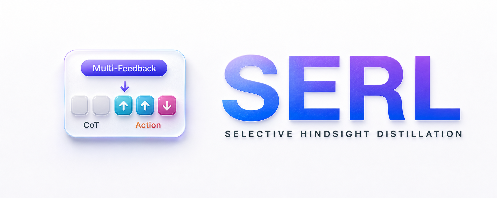

<p align="center">
    
</p>

# SERL

SERL is a reinforcement-learning recipe for long-horizon LLM agents. It uses environment feedback as a training-time credit-assignment signal while keeping policy optimization anchored to task rewards.

This repository focuses on two text-agent environments:

- ALFWorld
- WebShop

The main entrypoints are:

- `recipe/serl/run_alfworld.sh`
- `recipe/serl/run_webshop.sh`

## Contents

- [Features](#features)
- [Repository Layout](#repository-layout)
- [Method Overview](#method-overview)
- [Feedback Modes](#feedback-modes)
- [Anchor Modes](#anchor-modes)
- [LLM-Judged Feedback](#llm-judged-feedback)
- [Trajectory Format](#trajectory-format)
- [Installation](#installation)
- [Quickstart](#quickstart)
- [Default Training Settings](#default-training-settings)
- [Acknowledgement](#acknowledgement)

## Features

- Step-wise multi-turn agent-environment interaction.
- SERL action-mask policy loss: `actor_rollout_ref.actor.policy_loss.loss_mode=serl_action_mask`.
- Configurable training-time feedback from immediate feedback, next observation, future trajectory, successful trajectory, and mixed variants.
- Anchor variants that place feedback around semantically meaningful state groups.
- LLM-judged feedback modes for compact trajectory diagnostics.
- Two trajectory organization formats: `response` and `observation_action`.
- Dedicated scripts for ALFWorld and WebShop.

## Repository Layout

```text
recipe/serl/                         SERL training recipe, config, and launch scripts
recipe/serl/run_alfworld.sh          ALFWorld launch script
recipe/serl/run_webshop.sh           WebShop launch script
agent_system/environments/           Multi-turn agent environment wrappers
judge_utils/                         Utilities for LLM-judged feedback
examples/data_preprocess/prepare.py  Text-mode parquet preparation
docs/serl/                           SERL logo assets
```

## Method Overview

SERL separates three implementation choices:

1. **Feedback source**  
   The feedback context can come from immediate feedback, next observations, future trajectories, successful trajectories, current trajectories, or combinations of these signals.

2. **Feedback placement**  
   Feedback can be applied at every transition or concentrated around anchor states.

3. **Feedback strength**  
   Feedback-conditioned teacher scores are converted into bounded, action-token-level weights. Reasoning and formatting tokens keep the original reward-driven update.

The task reward still determines whether sampled behavior should be reinforced or suppressed. Feedback adjusts the locality and magnitude of that update.

## Feedback Modes

Set the feedback source with `SAMPLING_MODE=<mode>`. The scripts default to `immediate_feedback`.

Implementation names use `successful_sample` for a successful trajectory reference.

| `SAMPLING_MODE` | Feedback source |
| --- | --- |
| `immediate_feedback` | immediate feedback |
| `next_observation` | next observation |
| `future_trajectory` | future trajectory |
| `successful_sample_or_immediate_feedback` | successful trajectory or immediate feedback |
| `successful_sample_immediate_feedback` | successful trajectory and immediate feedback |
| `successful_sample_next_observation` | successful trajectory and next observation |
| `successful_sample_future_trajectory` | successful trajectory and future trajectory |
| `successful_sample_future_trajectory_immediate_feedback` | successful trajectory, future trajectory, and immediate feedback |
| `successful_sample_future_trajectory_next_observation` | successful trajectory, future trajectory, and next observation |

Examples:

```bash
SAMPLING_MODE=immediate_feedback bash recipe/serl/run_alfworld.sh
SAMPLING_MODE=successful_sample_immediate_feedback bash recipe/serl/run_webshop.sh
SAMPLING_MODE=successful_sample_future_trajectory_next_observation bash recipe/serl/run_webshop.sh
```

## Anchor Modes

Anchor placement is enabled by using the `anchor_` prefix. To disable anchor placement, use the corresponding non-anchor mode.

Supported anchor modes:

```text
anchor_immediate_feedback
anchor_next_observation
anchor_future_trajectory
anchor_successful_sample_or_immediate_feedback
anchor_successful_sample_immediate_feedback
anchor_successful_sample_next_observation
anchor_successful_sample_future_trajectory
anchor_successful_sample_future_trajectory_immediate_feedback
anchor_successful_sample_future_trajectory_next_observation
```

Examples:

```bash
SAMPLING_MODE=anchor_immediate_feedback bash recipe/serl/run_alfworld.sh
SAMPLING_MODE=anchor_successful_sample_immediate_feedback bash recipe/serl/run_webshop.sh
```

Optional similarity filtering can be enabled with Hydra overrides:

```bash
SAMPLING_MODE=anchor_immediate_feedback \
bash recipe/serl/run_webshop.sh \
  actor_rollout_ref.actor.serl.anchor_enable_similarity=True \
  actor_rollout_ref.actor.serl.anchor_similarity_thresh=0.95
```

## LLM-Judged Feedback

SERL supports judged feedback, where an OpenAI-compatible judge model summarizes a trajectory into concise guidance before teacher scoring.

Supported modes:

| `SAMPLING_MODE` | Meaning |
| --- | --- |
| `judge_current_traj` | Judge the current trajectory. |
| `judge_current_traj_on_successful_sample` | Judge the current trajectory with a successful trajectory as reference. |

Example:

```bash
JUDGE_API_URL=http://localhost:8000/v1 \
JUDGE_MODEL=your-judge-model \
JUDGE_API_KEY=your-api-key \
SAMPLING_MODE=judge_current_traj \
bash recipe/serl/run_alfworld.sh
```

## Trajectory Format

SERL supports two trajectory organization formats:

| Format | Description |
| --- | --- |
| `response` | Response-oriented trajectory rendering. This is the default. |
| `observation_action` | Observation-action turn rendering. |

Choose the format with `TRAJECTORY_FORMAT=<format>`:

```bash
TRAJECTORY_FORMAT=response bash recipe/serl/run_alfworld.sh
TRAJECTORY_FORMAT=observation_action bash recipe/serl/run_webshop.sh
```

## Installation

### Base Runtime

Create the base SERL environment from the repository root:

```bash
conda create -n serl python==3.12 -y
conda activate serl

pip3 install vllm==0.11.0
pip3 install flash-attn==2.7.4.post1 --no-build-isolation --no-cache-dir
pip install -e .
```

Environment packages may have conflicting Python and dependency requirements. Use a separate conda environment for each environment backend when needed.

### ALFWorld

Install ALFWorld:

```bash
pip3 install gymnasium==0.29.1
pip3 install stable-baselines3==2.6.0
pip install alfworld
```

Download PDDL files, game files, and the pretrained MaskRCNN detector:

```bash
alfworld-download -f
```

Use `--extra` if you also want pretrained checkpoints and seq2seq data:

```bash
alfworld-download -f --extra
```

Verify the text game installation:

```bash
alfworld-play-tw
```

### WebShop

WebShop requires Python `<=3.10`, so create a dedicated environment:

```bash
conda create -n serl-webshop python==3.10 -y
conda activate serl-webshop
```

Install WebShop data and dependencies:

```bash
cd ./agent_system/environments/env_package/webshop/webshop
./setup.sh -d all
```

If `gdown` fails, visit `https://drive.google.com/`, get your Google Drive cookie, and paste it into `.cache/gdown/cookies.txt`. Manual download of the required files is also acceptable.

After WebShop is installed, return to the SERL repository root and install the training dependencies in the same `serl-webshop` environment:

```bash
cd /path/to/SERL
pip3 install torch==2.6.0 --index-url https://download.pytorch.org/whl/cu124
pip3 install flash-attn==2.7.4.post1 --no-build-isolation
pip3 install -e .
pip3 install vllm==0.8.2
```

Warnings about `spacy` or `weasel` requiring an older `typer` can be ignored for the WebShop training scripts.

## Quickstart

### Prepare Text Data

The parquet files provide the text modality marker and dataset size. The actual task, observation, admissible actions, reward, and feedback are produced by the environment during rollout.

```bash
mkdir -p ~/data/serl/text
python3 examples/data_preprocess/prepare.py \
  --mode text \
  --local_dir ~/data/serl \
  --train_data_size 256 \
  --val_data_size 256
```

This creates:

```text
~/data/serl/text/train.parquet
~/data/serl/text/test.parquet
```

### Run ALFWorld

```bash
conda activate serl
bash recipe/serl/run_alfworld.sh
```

Common overrides:

```bash
MODEL_PATH=Qwen/Qwen2.5-7B-Instruct \
TRAIN_FILE=~/data/serl/text/train.parquet \
VAL_FILE=~/data/serl/text/test.parquet \
OUTPUT_ROOT=./outputs/alfworld \
SAMPLING_MODE=immediate_feedback \
TRAJECTORY_FORMAT=response \
bash recipe/serl/run_alfworld.sh
```

### Run WebShop

```bash
conda activate serl-webshop
bash recipe/serl/run_webshop.sh
```

Common overrides:

```bash
MODEL_PATH=Qwen/Qwen2.5-7B-Instruct \
TRAIN_FILE=~/data/serl/text/train.parquet \
VAL_FILE=~/data/serl/text/test.parquet \
OUTPUT_ROOT=./outputs/webshop \
SAMPLING_MODE=immediate_feedback \
TRAJECTORY_FORMAT=response \
bash recipe/serl/run_webshop.sh
```

The first positional argument can switch the rollout engine:

```bash
bash recipe/serl/run_alfworld.sh vllm
bash recipe/serl/run_webshop.sh vllm
```

Arbitrary Hydra overrides can be appended after the script:

```bash
SAMPLING_MODE=anchor_successful_sample_immediate_feedback \
bash recipe/serl/run_webshop.sh \
  trainer.total_epochs=150 \
  actor_rollout_ref.actor.optim.lr=1e-6
```

## Default Training Settings

The launch scripts use these defaults:

| Setting | ALFWorld | WebShop |
| --- | ---: | ---: |
| Base model | Qwen2.5-7B-Instruct | Qwen2.5-7B-Instruct |
| Rollout group size | 8 | 8 |
| Learning rate | `1e-6` | `1e-6` |
| Max environment steps | 50 | 15 |
| PPO mini-batch size | 256 | 64 |
| PPO micro-batch size per GPU | 32 | 8 |
| Initial distillation coefficient | 0.5 | 0.5 |
| Decay steps | 50 | 50 |
| Weight clip | 0.2 | 0.2 |
| Teacher sync interval | 10 | 10 |

The scripts expose common settings through environment variables:

| Variable | Default |
| --- | --- |
| `MODEL_PATH` | `Qwen/Qwen2.5-7B-Instruct` |
| `TRAIN_FILE` | `~/data/serl/text/train.parquet` |
| `VAL_FILE` | `~/data/serl/text/test.parquet` |
| `OUTPUT_ROOT` | `./outputs/<env>` |
| `SAMPLING_MODE` | `immediate_feedback` |
| `TRAJECTORY_FORMAT` | `response` |
| `N_GPUS_PER_NODE` | `8` |
| `TENSOR_MODEL_PARALLEL_SIZE` | `2` |
| `GROUP_SIZE` | `8` |

## Acknowledgement

SERL is implemented on top of [veRL](https://github.com/volcengine/verl). The environment integrations build on [ALFWorld](https://github.com/alfworld/alfworld) and [WebShop](https://github.com/princeton-nlp/WebShop). We thank the authors and contributors of these projects.
